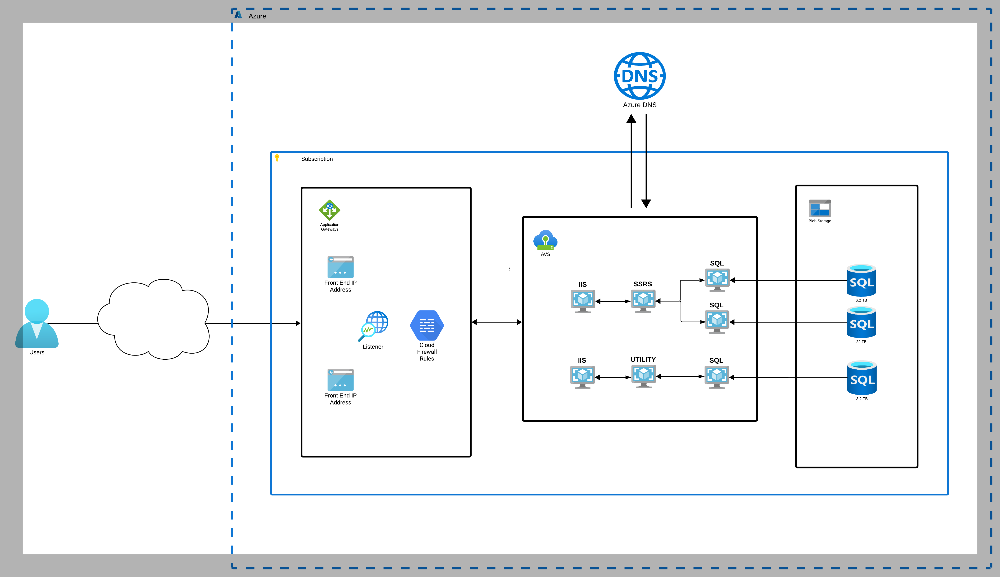

### **What the Schematic Shows**

1. **User Access**:
    - Users connect to the environment via the public internet.
    - Traffic flows through an **Azure Application Gateway**, which provides:
        - Front-end IP addressing.
        - A listener to route HTTP/HTTPS traffic.
        - Firewall rules for securing the environment.

2. **Azure DNS**:
    - Azure DNS is used for name resolution, mapping domain names to public IP addresses and directing traffic to the appropriate Application Gateway.

3. **Azure VMware Solution (AVS)**:
    - AVS hosts a set of virtual machines, represented by:
        - **IIS (Web Servers)**: Likely hosting web applications or APIs.
        - **SQL Servers**: Used for database management and reporting.
        - **SSRS (SQL Server Reporting Services)**: Likely for business intelligence and reporting.
        - **Utility VMs**: Possibly for file transfers or ancillary services.

4. **SQL Databases**:
    - SQL databases are deployed with various capacities (e.g., 6.2 TB, 22 TB, 3.2 TB).
    - Likely used for application data, reporting data, and other workloads.

5. **Blob Storage**:
    - Blob storage is depicted for storing unstructured data, backups, or large files.

6. **Traffic Flow**:
    - User traffic is directed to the Application Gateway, which forwards requests to the appropriate VMs in AVS.
    - AVS resources communicate internally and with Azure services (e.g., Blob Storage).

---

### **Strengths of the Current Design**
- **Application Gateway**: Provides centralized traffic management and firewalling.
- **AVS**: Enables seamless lift-and-shift of VMware workloads into Azure while maintaining compatibility with on-premises VMware tools.
- **Separation of Concerns**:
    - Different services are logically separated (e.g., IIS, SQL, SSRS).
- **Scalability**:
    - Azure services like Blob Storage and SQL can scale based on demand.

---

### **Areas for Improvement**

1. **Modernization Opportunities**:
    - **Use PaaS Services**:
        - Replace SQL Server on VMs with **Azure SQL Database** or **Azure SQL Managed Instance** for better scalability, performance, and reduced management overhead.
        - Replace IIS on VMs with **Azure App Services** for hosting web applications.

    - **Eliminate AVS**:
        - If no specific VMware dependencies exist, consider replacing AVS with native Azure services like Virtual Machine Scale Sets or Azure Kubernetes Service (AKS).

2. **High Availability**:
    - **Application Gateway Redundancy**:
        - Ensure the Application Gateway is deployed across multiple zones or regions for fault tolerance.
    - **SQL HA**:
        - Implement **Always On Availability Groups** for SQL Servers if they remain on VMs.
    - **SSRS HA**:
        - Consider redundant SSRS deployments.

3. **Network Security**:
    - Integrate **Azure Firewall** for more robust network security beyond Application Gateway.
    - Implement **NSGs (Network Security Groups)** and **Private Link** to restrict traffic to trusted sources and ensure secure communication between services.

4. **Monitoring and Logging**:
    - Use **Azure Monitor** and **Log Analytics** for centralized monitoring.
    - Enable **Application Insights** for tracking application performance.

5. **Representation Improvements**:
    - **Add Subnets and VNets**:
        - Show virtual networks and subnets explicitly to clarify how resources communicate.
    - **Highlight Redundancy**:
        - Include multiple instances of Application Gateway, SQL Servers, or other critical components if high availability is implemented.
    - **Service Labels**:
        - Add labels like "Web Tier," "Data Tier," etc., to improve clarity for stakeholders.

---

### **Proposed Modernized Architecture**

- **Web Layer**:
    - Use **Azure Front Door** for global routing and web application firewall (WAF).
    - Host applications on **Azure App Services** instead of IIS VMs.

- **Data Layer**:
    - Migrate SQL workloads to **Azure SQL Managed Instance** or **Azure Cosmos DB** if NoSQL is required.
    - Use **Azure Storage Account** for large file storage instead of hosting blobs directly in AVS.

- **Networking**:
    - Replace AVS-specific networking with Azure Virtual Networks, **Azure ExpressRoute** (if hybrid), and **Azure Private Link**.

---

### **Conclusion**
While the current architecture makes good use of AVS for VMware workloads, it can benefit from modernization by transitioning to Azure PaaS services, improving availability and cost-efficiency. The schematic can also be improved by adding visual clarity with network components, redundant setups, and service boundaries.