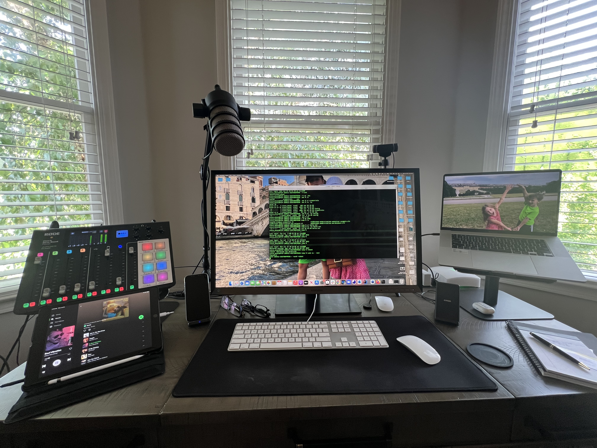

  

# Podcasting / Streaming Gear

| Product | Purpose | Why It’s Good | Cost (approx.) | Link |
|---------|---------|---------------|----------------|------|
| **RØDE PodMic (B07MSCRCVK)** | Broadcast-quality dynamic microphone optimized for podcasting | Rich, balanced sound; built-in pop filter reduces plosives; internal shock mounting minimizes vibration; highly optimized for Rode RØDECaster Pro but excellent with any XLR interface | ~$99 USD | [Amazon Link](https://www.amazon.com/dp/B07MSCRCVK) |
| **RØDE RØDECaster Pro II (B0B17V8NGX)** | All-in-one audio production console for podcasting, streaming, music, content creation | Combines multiple studio-grade tools into one; ultra-low-noise Revolution preamps; APHEX processing; touchscreen, smart pads, flexible I/O (USB/Bluetooth/Ethernet) | ~$614.09 USD | [Amazon Link](https://www.amazon.com/Rode-Rodecaster-Podcast-Production-Console/dp/B0B17V8NGX) |
| **RØDE PSA-1 Boom Arm (B001D7UYBO)** | Broadcast-style swivel mount boom arm for desk-mounting microphones | Durable, precise positioning; widely recommended by users; keeps mic out of the way while easy to reposition | ~$108 USD | [Amazon Link](https://www.amazon.com/dp/B001D7UYBO) |
| **Amazon Basics XLR Microphone Cable (10 ft) (B01JNLUA5G)** | Standard XLR male-to-female cable for connecting microphones to audio interfaces or mixers | Affordable, all-copper conductors for clear signal transmission; very popular choice in mic-cable searches | ~$8–$9 USD | [Amazon Link](https://www.amazon.com/dp/B01JNLUA5G) |

---

## Notes & Highlights

### 1. **RØDE PodMic**
- Dynamic mic designed for vocal clarity in podcasting.
- Built-in pop and shock filters help minimize studio noise and plosives.
- Commonly priced around **$99 USD**.
- [View on Amazon](https://www.amazon.com/Rode-PODMIC-Dynamic-Podcasting-Microphone/dp/B07MSCRCVK?utm_source=chatgpt.com)

### 2. **RØDE RØDECaster Pro II**
- All-in-one console combining audio interface, mixer, effects, and preamps.
- Ideal for podcasters, streamers, live musicians.
- Retail price noted at **$614.09 USD**.
- [View on Amazon](https://www.amazon.com/Rode-Rodecaster-Podcast-Production-Console/dp/B0B17V8NGX?utm_source=chatgpt.com)

### 3. **RØDE PSA-1 Boom Arm**
- Allows flexible mic placement and easy repositioning while remaining low-profile.
- Praised for value and durability.
- Priced around **$108 USD**.
- [View on Amazon](https://www.amazon.com/RODE-Swivel-Mount-Studio-Microphone/dp/B001D7UYBO?utm_source=chatgpt.com)

### 4. **Amazon Basics XLR Cable**
- Reliable, budget cable for connecting XLR mics to audio interfaces.
- Affordable at roughly **$8–$9 USD**.
- [View on Amazon](https://www.amazon.com/Amazon-Basics-Microphone-Speaker-Conductors/dp/B01JNLUA5G?utm_source=chatgpt.com)

